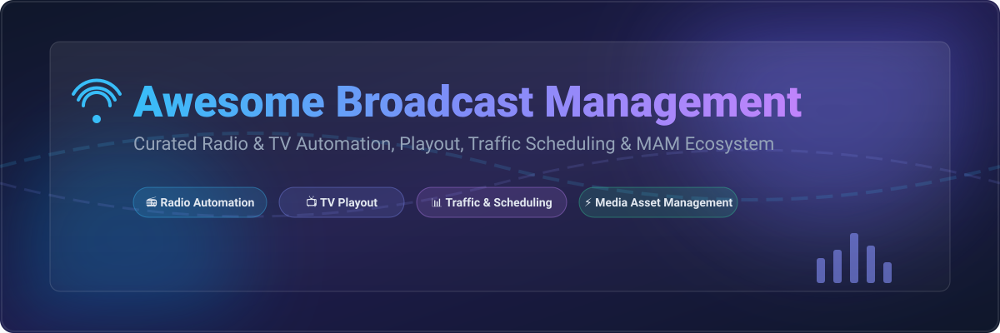

# 📻 Awesome Broadcast Management 📺

  

  
  
  
  
  

## 🚀 Top Broadcast Management Ecosystem & Open-Source Tools

**A curated list of enterprise SaaS platforms and production-grade open-source software for Broadcast Automation, Radio Playout, TV Channel Playout, Traffic & Billing Scheduling, and Media Asset Management (MAM).**

---

### 🔍 Overview & Key Capabilities

This repository tracks leading **SaaS platforms** and **open-source GitHub projects** designed for **Broadcast Management**. These software solutions power linear television channels, radio stations, web-radio streams, OTT services, and community broadcasters by automating:
- 🎙️ **Radio Playout & Live Assist** (On-air logs, jingle rotation, music scheduling, Cartesian carts)
- 🎥 **TV Automation & Playout** (Channel-in-a-Box, graphics overlays, SDI/NDI/IP stream output, CasparCG/Liquidsoap integration)
- 📅 **Traffic, Billing & Log Scheduling** (Commercial spot placement, ad rotation, invoice reconciliation, EPG generation)
- 🗄️ **Media Asset Management (MAM)** (EBU Core cataloging, proxy transcoding, ingestion, archive management)
- 🚨 **Emergency Alert Systems (EAS)** (CAP alerting, compliance logging, regulatory safety)

---

## 📌 Table of Contents

- [🏢 SaaS/Hosted Platforms](#-saashosted-platforms)
- [🔓 Open-Source GitHub Projects](#-open-source-github-projects)
- [🤝 How to Contribute](#-how-to-contribute)
- [💖 Support & Sponsorship](#-support--sponsorship)
- [⚠️ Disclaimer](#%EF%B8%8F-disclaimer)
- [📈 Star History](#-star-history)

---

## 🏢 SaaS/Hosted Platforms

The broadcast management software market is estimated at **$2.4B – $2.6B** in 2025/2026 (projected to reach over $6B–$10B by 2030–2033 with an ~18% CAGR). The market is **moderately fragmented**: enterprise TV and radio broadcasters are served by established category leaders like WideOrbit, Imagine Communications, and Marketron (often acquired by media tech holding conglomerates like Lumine Group or private equity), alongside specialized vendors for niche sub-sectors (radio playout, cloud streaming, channel-in-a-box).

| Platform | Description | Starting Pricing | Free Tier / Trial Limit | Company Size (Est. Revenue / Valuation) |
| :--- | :--- | :--- | :--- | :--- |
| **[WideOrbit](https://www.wideorbit.com/)** | Comprehensive broadcast management platform covering traffic, billing, sales, and program scheduling for radio and television. | ~$5,000/month (Custom enterprise tier quotes) | No free tier; demo upon request | Est. Valuation: $490M (Acquired by Lumine Group; ~$167M revenue) |
| **[Imagine Communications](https://www.imaginecommunications.com/)** | Broadcast and media software solutions covering playout, automation, and advertising management. | ~$3,000/month (Custom enterprise quotes) | No free tier; demo upon request | Est. Revenue: $150M–$250M (Acquired by Lumine Group) |
| **[RCS Zetta](https://www.rcsworks.com/)** | Radio automation and playout system with scheduling, music rotation, and live production tools. | ~$1,500/month (Enterprise station licensing quote) | No free tier; demo upon request | Est. Revenue: $50M–$100M (Subsidiary of iHeartMedia / Executive Media) |
| **[Marketron](https://marketron.com/)** | Radio and television traffic, billing, and revenue management platform for broadcasters. | ~$1,000/month (Custom quote based on station revenue) | No free tier; demo upon request | Est. Revenue: $45M–$50M (Acquired by Diversis Capital) |
| **[ENCO DAD](https://www.enco.com/)** | Radio and television automation system with playout, scheduling, and live assist capabilities. | ~$500/month (Hardware/license quote package starting ~$2,800 upfront) | No free tier; interactive demo upon request | Est. Revenue: $20M–$30M |
| **[PlayBox Neo](https://www.playboxneo.com/)** | Broadcast playout and channel-in-a-box solutions for television operations. | ~$400/month (Server software quote starting ~$1,500 upfront) | 30-day trial upon partner request | Est. Revenue: $15M–$25M |
| **[BroadView](https://www.broadviewsoftware.com/)** | Broadcast management software for traffic, billing, and scheduling. | ~$300/month (Custom quote per channel/station) | No free tier; demo upon request | Est. Revenue: $10M–$15M |
| **[Radio.co](https://radio.co/)** | Cloud-based radio broadcasting platform with automation, scheduling, and streaming. | $35/month (Lite plan) | 7-day free trial (up to 10GB storage & 10 listeners) | Est. Revenue: $5M–$10M |
| **[Myriad Playout](https://www.myriadplayout.com/)** | Radio playout and automation software with scheduling, music rotation, and live assist capabilities. | ~£69/month (~$90/month for Basic Cloud tier) | 14-day free trial (full features) | Est. Revenue: $2M–$5M (Broadcast Radio Ltd) |
| **[TrafficLive](https://www.trafficlive.com/)** | Cloud-based traffic and scheduling system for radio and television broadcasters. | ~$20/user/month (Custom quote via Deltek) | 14-day free trial upon request | Est. Revenue: $1M–$5M (Deltek product division) |

---

## 🔓 Open-Source GitHub Projects

Below is a curated collection of active open-source repositories for self-hosting radio automation, television playout, stream management, and broadcast workflows, sorted by GitHub Stars_Count:

- **[OBS Studio](https://github.com/obsproject/obs-studio)**  
    
  🎥 Free and open-source software for video recording and live streaming. Used across broadcasting studios worldwide for scene switching, production compositing, audio mixing, and RTMP/SRT stream output. GPL-2.0 licensed.

- **[AzuraCast](https://github.com/AzuraCast/AzuraCast)**  
    
  📻 A complete, self-hosted web radio management suite. Offers a web panel to manage stations, playout automation via Liquidsoap, AutoDJ, user role management, web DJ interface, listener statistics, and integrated Icecast/Shoutcast servers. Apache-2.0 licensed.

- **[ErsatzTV](https://github.com/ErsatzTV/ErsatzTV)**  
    
  📺 Open-source application for configuring and streaming custom IPTV channels using media from local storage, Plex, Jellyfin, or Emby libraries. Supports HDHomeRun emulation, custom EPG schedules, hardware transcoding, and watermarks. MIT licensed.

- **[CasparCG Server](https://github.com/CasparCG/server)**  
    
  📡 Professional-grade Windows/Linux software used for playing out multi-layer dynamic graphics, video, and audio to multiple channels. Developed at Swedish National Television (SVT) and proven in 24/7 broadcast operations since 2006. GPL-3.0 licensed.

- **[LibreTime](https://github.com/libretime/libretime)**  
    
  🎙️ Radio Broadcast & Automation Platform, a community-maintained fork of Airtime. Web-based PHP application backed by Liquidsoap for playout, supporting scheduled playlists, live shows, podcast publishing, and remote contribution. AGPL-3.0 licensed.

- **[Sofie TV Automation](https://github.com/nrkno/tv-automation-server-core)**  
    
  🎬 Web-based TV automation system for studios and live news broadcasts, developed and used in daily production by Norwegian public broadcaster NRK as well as BBC and TV 2 Norway. Features state-based device control (video, audio, graphics) with MOS protocol support. MIT licensed.

- **[Rivendell](https://github.com/ElvishArtisan/rivendell)**  
    
  🎛️ Full-featured, production-grade Linux radio automation system designed for professional broadcast operations. Includes RDAdmin, RDLibrary audio database, RDCatch automated recording, RDLogManager log generator, and RDAirPlay for on-air playout. GPL-2.0 licensed.

- **[Nebula](https://github.com/nebulabroadcast/nebula)**  
    
  📊 Open-source broadcast automation and Media Asset Management (MAM) system for TV, radio, and VOD. Features EBU Core-compliant cataloging, automatic proxy transcoding, linear drag-and-drop scheduling, and CasparCG playout control. Used by Czech TV and Radio Free Europe. GPL-3.0 licensed.

- **[OpenBroadcaster (OBServer)](https://github.com/openbroadcaster/OBServer)**  
    
  🚨 Broadcast automation and emergency alerting platform. Combines OBServer (web management, scheduling, MAM) and OBPlayer (automation playout with CAP EAS Alerting) for community radio, TV, and digital signage. AGPL-3.0 licensed.

- **[EXStreamTV](https://github.com/roto31/EXStreamTV)**  
    
  📺 Platform that creates custom live TV channels from online sources (YouTube, Archive.org) and local media (Plex, Jellyfin). Emulates HDHomeRun for Plex DVR, outputs M3U/EPG, and supports hardware acceleration (NVENC, QSV, VAAPI). Python-based.

- **[XFB](https://github.com/netpack/XFB)**  
    
  🎚️ Cross-platform radio automation suite featuring scheduled playlists, jingle/ad rotation, 10-band live audio FX, DJ decks, Icecast streaming client, waveform crossfade preparation, and comprehensive screen-reader accessibility. GPL-3.0 licensed.

---

### 💡 Frameworks & Specialized Options

- **Comrad** — Open-source web application for radio stations to manage show schedules, traffic, and compliance.
- **django-radio / RadioCo** — Django-based radio management application for scheduling, live recording, and podcast publishing.
- **Vinyl** — Community & campus radio music library management system.
- **Radiotomate** — Web-based radio automation for community radio built on Python and Liquidsoap.

---

## 🤝 How to Contribute

Contributions are welcome! Please help keep this broadcast ecosystem list comprehensive and accurate:

1. 🍴 Fork the repository.
2. 📝 Add or update entries in `README.md` (following the existing layout and format).
3. 📌 Include project name, homepage/GitHub link, factual description, and Stars_Badge / pricing information.
4. 📬 Submit a Pull Request with a clear explanation of your additions.

---

## 💖 Support & Sponsorship

If you find this curated list of broadcast management tools helpful:

- ⭐ **Star this repository** on GitHub to support visibility!
- 🔀 **Fork & Share** it with broadcast engineers, station operators, and developers.
- ☕ **Buy me a coffee / Sponsor**: If you'd like to support ongoing maintenance of awesome open-source lists, consider sponsoring via the link below:

  

---

## ⚠️ Disclaimer

- This list is **community-curated** for informational purposes — not an exhaustive list or commercial endorsement.
- Operational broadcast management tools must comply with local telecommunications regulations, music licensing bodies (ASCAP, BMI, SESAC, PRS, etc.), and CAP/EAS emergency alerting standards.
- Self-hosted open-source software requires resilient hardware, audio interface routing, and redundant backup planning for 24/7 high-availability environments.

---

## 📈 Star History

---

  <b>Made with ❤️ for radio stations, television broadcasters, community media, and broadcast engineers.</b> 
  <i>Let's make broadcast management open, transparent, and accessible.</i>

